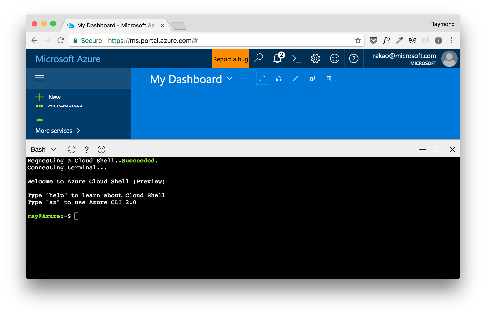

Setting up Environment
========================================
In this lab you will find the prerequisites and steps to help you set up your computer. After completing the lab you will have a working environment ready for the other labs.

Configure Computer
-----------------------

### Two Options
1. [Azure Cloud Shell](https://docs.microsoft.com/en-us/azure/cloud-shell/overview)

2. Install Necessary Tools

### Installing Necessary Tools:
1. Azure CLI v2: If you do not have the Azure CLI v2 installed on your computer, click [here](https://docs.microsoft.com/en-us/cli/azure/install-azure-cli) for the different operating systems.
2. Install docker: Click [here](https://docs.docker.com/docker-for-mac/install/) for Mac OSX. Click [here](https://docs.docker.com/docker-for-windows/install/) for Windows.

### Create Docker-Machine

```
# Not needed for cloud shell - you're already logged in
az login

az group create \
    --name <resource_group_name>
    --location canadacentral 

az account list

docker-machine create \
    --driver azure \
    --azure-subscription-id <subscription_id> \
    --azure-image  "Canonical:UbuntuServer:16.04-LTS:latest" \
    --azure-size "Standard_D2_v2" \
    --azure-resource-group docker-machine-<alias> \
    --azure-location canadacentral \
    docker-machine-<alias>
```

### Validating Tools & Getting Started:
1. Check Azure CLI is working:
```bash
az --version
```
2. Check docker is working: Click [here](https://docs.docker.com/docker-for-mac/) for Mac OSX. Click [here](https://docs.docker.com/docker-for-windows/) for Windows.