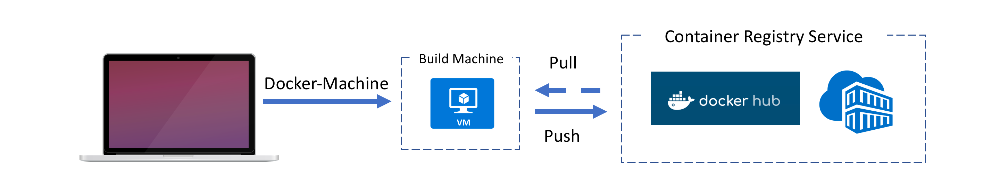

Setting up Environment
========================================
In this lab you will find the prerequisites and steps to help you set up your computer. After completing the lab you will have a working environment ready for the other labs.

Configure Computer
-----------------------

### Two Options
1. [Azure Cloud Shell](https://docs.microsoft.com/en-us/azure/cloud-shell/overview)

2. Install Necessary Tools

### Installing Necessary Tools:
1. Azure CLI v2: If you do not have the Azure CLI v2 installed on your computer, click [here](https://docs.microsoft.com/en-us/cli/azure/install-azure-cli) for the different operating systems.
2. Install docker: Click [here](https://docs.docker.com/docker-for-mac/install/) for Mac OSX. Click [here](https://docs.docker.com/docker-for-windows/install/) for Windows.

### Create Docker-Machine

We will use the ```docker-machine``` command to provision a VM to Azure and install the Docker engine on to it.  This remote Docker host will be used to pull and push container images to a registry and build custom images from.  We do this by configuring our local Docker Environment variablesto "point to" the remote Docker host.  This will allow us to run Docker commands from our local terminal, but the commands will actually execute remotely on the Docker host.



```
# Not needed for cloud shell - you're already logged in
az login

az group create \
    --name docker-machine-<alias>-rg
    --location canadacentral 

az account list

docker-machine create \
    --driver azure \
    --azure-subscription-id <subscription_id> \
    --azure-image  "Canonical:UbuntuServer:14.04.5-LTS:latest" \
    --azure-size "Standard_D2_v2" \
    --azure-resource-group docker-machine-<alias>-rg \
    --azure-location canadacentral \
    docker-machine-<alias>

eval $(docker-machine env docker-machine-<alias>)
```

### Validating Tools & Getting Started:
1. Check Azure CLI is working:
```bash
az --version
```
2. Check docker is working: Click [here](https://docs.docker.com/docker-for-mac/) for Mac OSX. Click [here](https://docs.docker.com/docker-for-windows/) for Windows.