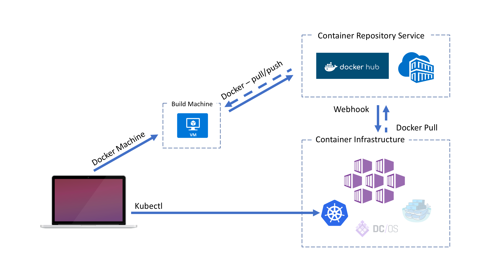

Run Sample App
========================================
In this section we will run a sample application on the Cluster created in Lab 2 to give you a feeling for what running containers looks like.

Run App
-----------------------

### Setup Environment for Sample App
This section will take us through the steps of setting up the environment so that the K8s cluster can connect to our private repo in ACR and pull down images.




```bash
# Create environment variables so that things like passwords are not in plain text.
export DOCKER_REGISTRY=$(az acr show --resource-group myResourceGroup --name myK8sCluster-<alias> --query loginServer --output tsv)
export DOCKER_USER=<acrName>
export DOCKER_PASSWORD=$(az acr credential show --resource-group myResourceGroup --name myK8sCluster-<alias> --query passwords[0].value --output tsv)

# Setup K8s Secret to be able to connect to private ACR Registry.
kubectl create secret docker-registry <alias>-secret \
    --docker-server=${DOCKER_REGISTRY} \
    --docker-username=${DOCKER_USER} \
    --docker-password=${DOCKER_PASSWORD} \
    --docker-email=<alias>@microsoft.com \
    --namespace=default --save-config
```

### Explore Kube Config File.
Explore the azure-vote.yaml file. This is an example of a K8s configuration file that we will be using to deploy our sample application.

### Deploy the App & Test.
Explore the azure-vote.yaml file. This is an example of a K8s configuration file that we will be using to deploy our sample application.


```bash
# Run K8s File.
kubectl create -f azure-vote.yaml

# Test the App.
kubectl get service azure-vote-front --watch
```

Initially the EXTERNAL-IP for the azure-vote-front service appears as pending. Once the EXTERNAL-IP address has changed from pending to an IP address put that in your browser to test out the app.

### Clean up the Deployment.
The following steps outline how to remove the deployment from teh K8s cluster.

```bash
# Delete the external facing front-end service.
kubectl delete svc azure-vote-front

# Run the Test line again to see what has changed.

# Delete the external facing back-end service.
kubectl delete svc azure-vote-back

# Delete the deployment.
kubectl delete deploy azure-vote-front
```